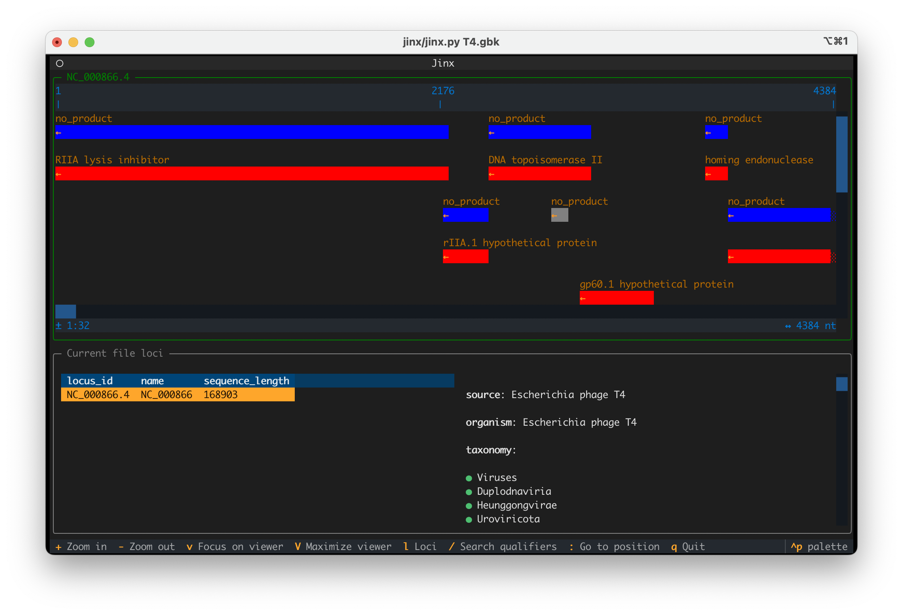
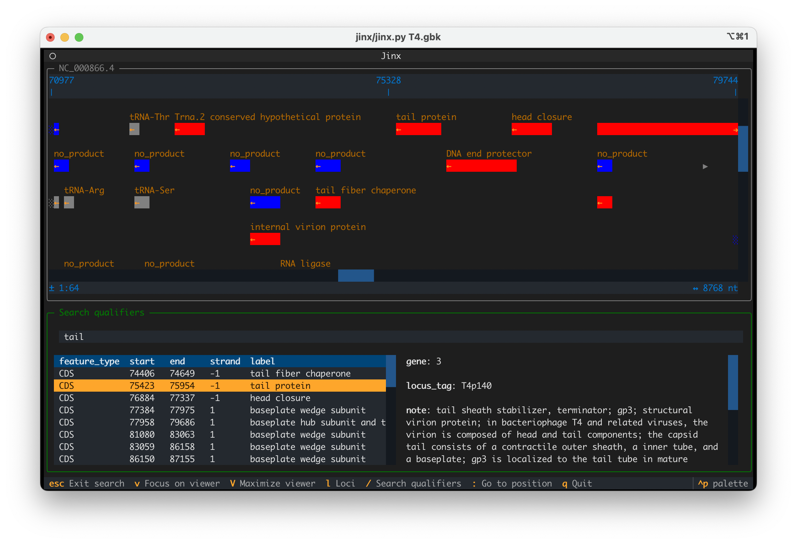

# Jinx
Jinx is an interactive terminal-based viewer for genbank files

In the great tradition of wacky bioinformatic acronyms, "Jinx" stands for "GENe eXplorer"




## First steps

After cloning the repo, all dependencies can be installed with Conda:

```
conda env create -f environment.yaml
```

Launching Jinx is then as easy as:

```
jinx/jinx.py path_to_file.gbk
```

## What now?

Detailed help with all available key bindings is [available here](jinx/assets/help.md)